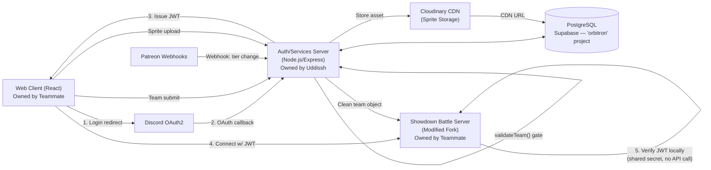

# Fakemon Chaos — Technical Requirements Document

**Version:** 1.0
**Date:** June 20, 2026
**Companion to:** PRD.md v2.0

---

## 1. System Architecture

Two independently deployable services, communicating through a stateless JWT contract and a shared PostgreSQL database. Neither developer commits to the other's repository.



### Repository split

| Repo | Owner | Contents |
|---|---|---|
| `fakemon-server` | Uddissh | Auth server, Patreon webhook handler, Postgres schema/migrations, sprite pipeline, moderation queue API |
| `fakemon-showdown` | Teammate | Forked `pokemon-showdown` + `pokemon-showdown-client`, BST slider UI, battle engine modifications |

Integration point: a single internal API contract (Section 2) plus a shared JWT secret stored as an environment variable on both services, never committed to git.

---

## 2. API & Auth Contract

### 2.1 Why JWT over server-to-server calls

Two options were evaluated:

- **Server-to-server verification:** Showdown calls the auth server on every battle join to check identity/tier. Simple but couples battle availability to auth-server uptime and adds latency to every join.
- **JWT (chosen):** Auth server issues a short-lived signed JWT at login. Showdown verifies the signature locally with no network call. Battle server has zero runtime dependency on the auth server once a player is connected.

### 2.2 JWT payload

```json
{
  "sub": "discord_user_id",
  "username": "DiscordHandle",
  "tier": 2,
  "is_moderator": false,
  "iat": 1750000000,
  "exp": 1750003600
}
```

- Signed with HS256 using a shared secret (`JWT_SHARED_SECRET`), identical on both services.
- Expiry: 1 hour. Client silently re-requests a fresh token from the auth server on expiry; no re-login required if the Discord session is still valid.
- Showdown's connection handler verifies signature + expiry before accepting a battle-relevant action. Invalid/expired tokens are rejected at the WebSocket handshake.

### 2.3 Team submission contract

The client never talks to the Showdown server directly with a raw team. It always passes through the auth server's `validateTeam()` gate first.

```json
{
  "player_discord_id": "...",
  "team": [
    {
      "name": "Abomination",
      "types": ["Fire", "Ghost"],
      "stats": { "hp": 80, "atk": 150, "def": 60, "spa": 90, "spd": 60, "spe": 240 },
      "ability": "Speed Boost",
      "moves": ["Flare Blitz", "Shadow Ball", "Protect", "Swords Dance"],
      "item": "Choice Scarf",
      "sprite_url": "https://res.cloudinary.com/.../abc123.png",
      "nickname": "Big Mistake"
    }
  ]
}
```

`validateTeam()` checks, in order: BST sum ≤ 680, individual stat range 1–255, hard-ban combinations (Section 3), sprite `is_approved` status if a custom sprite is referenced, and tier entitlement (e.g., a Tier 1 user cannot reference a custom sprite at all). It returns either a clean, Showdown-ready pack string or an array of human-readable violation messages — never both.

---

## 3. Validation Strategy

Two distinct validation layers, kept separate deliberately:

### 3.1 Request shape validation — Zod
Every HTTP route on the auth server defines a Zod schema for its request body. Invalid shape/type/missing fields return `400` before any business logic or DB call executes. The same Zod schemas are shared with the teammate's client code for form validation, keeping a single source of truth between frontend and backend.

### 3.2 Domain/ruleset validation — `validateTeam()`
A standalone, independently unit-tested function. It does not touch HTTP concerns — it accepts a parsed team object and returns a validation result. This isolation makes it testable against every hard-ban combination without spinning up a server.

```ts
type ValidationResult =
  | { valid: true; packedTeam: string }
  | { valid: false; violations: string[] };

function validateTeam(team: TeamInput, userTier: number): ValidationResult
```

### 3.3 Hard-ban enforcement table

| Rule | Enforced in |
|---|---|
| No Guard + OHKO move | `validateTeam()` |
| Wonder Guard (full ban) | `validateTeam()` AND Showdown engine ability handler (defense in depth) |
| Imposter HP cap (50% of target base HP) | Showdown engine ability handler only — runtime battle logic, not pre-validation |
| BST ≤ 680 | `validateTeam()` |
| Stat range 1–255 | UI slider ceiling + `validateTeam()` |

---

## 4. Hosting & Infrastructure

### 4.1 Decision driver

Target audience is primarily US/EU (competitive Pokémon community + meme/TikTok virality channels). The home server in Lucknow sits behind DuckDNS on an unreliable consumer connection. Round-trip latency from India to US/EU players, stacked on top of application logic, risks violating the < 300ms battle action NFR. Battle server hosting is therefore **not** home-hosted.

### 4.2 V1 Soft Launch stack (target: $0/month)

| Component | Provider | Notes |
|---|---|---|
| Battle server (`fakemon-showdown`) | Oracle Cloud Free Tier (ARM, 4 OCPU / 24GB RAM) | Permanently free tier, not a trial. Claim in US East (Ashburn) or Frankfurt. ARM availability requires a retry-claim script — instances are in high demand. |
| Auth/services server (`fakemon-server`) | Same Oracle Cloud instance (separate container) | Co-located for V1 to avoid cross-region latency between auth and battle server |
| PostgreSQL | Supabase Free Tier — existing `orbitron` project | Free tier projects pause after 7 days of inactivity — ping regularly during active dev. Upgrade to Pro ($25/mo) only once Phase 3 brings paying-user load. |
| Sprite storage/CDN | Cloudinary Free Tier | 25GB storage / 25GB bandwidth monthly. Home server never serves a sprite file directly. |
| Domain | DuckDNS (interim) → consider a real domain pre-launch for credibility | |

### 4.3 Phase 2/3 scaling path

If Oracle Free Tier ARM capacity is unavailable, or load outgrows it: migrate the battle server to **Hetzner CX21** (2 vCPU / 4GB RAM, €4.51/month, Finland or Germany). At 2+ Tier 1 Patreon subscribers, this cost is already covered by subscription revenue.

### 4.4 Local hardware note

The existing home server (Ubuntu, Circle CG 450W PSU, DDR3 8GB) remains the Docker/home-lab host for unrelated existing services (NAS, Home Assistant, ESPHome) and is **not** part of the Fakemon Chaos production path for V1. A hardware upgrade (Ryzen 5 5600 / B550 / 16GB DDR4 / Corsair CV450 PSU, ~₹22,000) is deferred — only relevant if/when the project moves fully in-house post-traction, not before.

---

## 5. Deployment & DevOps

Owned entirely by Uddissh — single point of ownership to avoid conflicting deployment assumptions between the two repos.

### 5.1 Containerization
Docker Compose, three services minimum:
- `auth-server` (Node.js/Express)
- `showdown` (forked battle server)
- Nginx reverse proxy in front of both (`api.fakemonchaos.com` → auth, `play.fakemonchaos.com` → client/Showdown)

PostgreSQL is **not** a local container in V1 — it's hosted on Supabase. Compose file only needs the two app services plus Nginx.

### 5.2 CI/CD
GitHub Actions on each repo. On push to `main`: SSH into the target Oracle Cloud instance, `git pull && docker compose up -d --build`. No manual deploys at any stage, including alpha.

**Set this up in Week 1, before any feature code.** A working "hello world" auto-deploy pipeline removes deployment risk from the final week, where it most commonly causes last-minute failures.

### 5.3 Secrets management
- `.env.example` committed to both repos with placeholder keys.
- Real `.env` files never committed.
- Secrets shared between the two developers via Bitwarden (or equivalent), never via Discord DM.
- Production secrets injected via environment variables in the Docker Compose file on the server.

---

## 6. Database Migrations

**Tool: Drizzle ORM.** TypeScript-native schema definitions, SQL-based migration files under the hood (raw SQL familiarity transfers directly), type-safe query results for both developers.

### 6.1 Hard rule
Neither developer alters the production schema directly via `psql`. Every change — no exceptions, including urgent fixes — goes through a generated migration file.

### 6.2 Workflow
1. Edit `schema.ts`
2. `drizzle-kit generate` → numbered SQL migration file
3. Commit migration file to git
4. `drizzle-kit migrate` → applies to Supabase Postgres
5. Teammate pulls, runs migrate, environments stay in sync

See `schema.ts` (companion deliverable) for the full V1 table definitions.

---

## 7. Content Moderation Pipeline (Technical)

1. Upload hits `/api/sprites/upload` → Zod validates request shape → size check (≤100KB) → Cloudinary ingest → row inserted into `sprites` table with `status: pending`.
2. Background job auto-flips `status` to `approved` after 24 hours if zero reports exist.
3. `/api/sprites/:id/report` increments a report counter. At 3 unique reporter IDs within 72 hours, `status` flips to `rejected` automatically and the sprite falls back to the default template sprite in all render paths.
4. Moderation queue UI (`/admin/queue`) lists `pending` and `rejected` sprites for the 2 core developers and 2 volunteer moderators (flagged via `is_moderator` on the `users` table). Approve/reject actions are logged to `moderation_actions`.
5. Sprite render step at battle time: checks `status === 'approved'` AND viewer's local `show_custom_sprites` preference. Falls back to default sprite otherwise — this check happens client-side per viewer, not globally, since blur opt-in is per-user.

---

## 8. Seasonal Modifier Engine Hooks (Built, Not Activated in V1)

Six toggleable hooks are implemented in the Showdown fork during V1 development so they exist as inventory for Phase 2 — avoiding a recurring "write new engine code every month" burden post-launch. Activation is a single database row update (`seasonal_modifiers.is_active`), not a deploy, once Phase 2 begins.

Each hook is a self-contained function registered against a known battle event (e.g., `onSourceModifyDamage`, `onFaint`) and gated by `seasonal_modifiers.engine_hook_key` matching the active row in the database.

---

## 9. Testing Strategy

- **Unit tests:** `validateTeam()` against every hard-ban combination in Section 3.3, plus boundary cases (exactly 680 BST, 679, 681).
- **Integration test:** Patreon webhook proof-of-concept (Week 1 priority) — Discord login → user row created → webhook received → tier column updated → idempotency check on duplicate event ID.
- **Alpha test:** 4 testers (2 core + 2 volunteer moderators), 50+ battles each across Chaos Mode and Total Chaos Mode, explicit exploit-hunting pass on the hard-ban ruleset before Phase 2 begins.

---

## 10. Open Technical Questions

| # | Question | Owner |
|---|---|---|
| 1 | Final onboarding flow for new users given Draft Mode deferral (see PRD Section 2) | Both — resolve Week 1 |
| 2 | Chaos Item registry — exact tradeoff mechanics per item | Teammate (engine) |
| 3 | Oracle Cloud ARM instance claim — confirm availability in target region | Uddissh — Week 1 |
| 4 | Co-locating auth server and battle server on one Oracle instance vs. splitting — revisit if either service shows resource contention | Uddissh |
